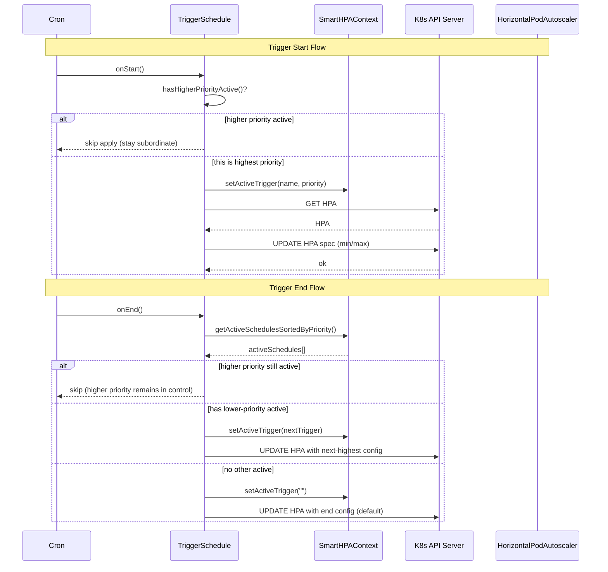

# SmartHPA Analysis Module & Controller Architecture (Design Doc)

## Overview

SmartHPA is a Kubernetes controller that extends the standard Horizontal Pod Autoscaler (HPA) by applying **time-windowed scaling policies** defined on a custom resource: `SmartHorizontalPodAutoscaler` (SmartHPA).

In this codebase, the **Analysis module** is implemented by the scheduler subsystem (`internal/scheduler`). It:

- Interprets SmartHPA `triggers` (interval + timezone + start/end times).
- Resolves overlapping triggers using **priority**.
- Applies the selected `HPAConfig` by updating the referenced `autoscaling/v2` `HorizontalPodAutoscaler`.

This doc describes the current architecture as implemented, the runtime flow, and the analysis logic.

## Goals / Non-Goals

- **Goals**
  - Provide a clear architecture view of the controller, queue, scheduler, and Kubernetes resources.
  - Specify how triggers are evaluated (time windows, recurrence/date ranges) and how overlaps are resolved (priority).
  - Document data flow and failure modes.

- **Non-Goals**
  - Implementing metrics-based or ML-driven recommendations (the API includes `SmartRecommendation`, but it is not wired into runtime logic today).
  - Replacing Kubernetes HPA logic; SmartHPA only updates the HPA spec, the standard HPA controller still performs scaling.

## System Components

### Kubernetes Resources

- **SmartHorizontalPodAutoscaler (CRD)**: desired “time-based policy” definition.
- **HorizontalPodAutoscaler (autoscaling/v2)**: the standard HPA whose `.spec.minReplicas` and `.spec.maxReplicas` are updated by SmartHPA.

### Controller Manager Process (`cmd/main.go`)

One manager process hosts:

- **Controller (Reconciler)**: watches SmartHPA resources and owned HPAs.
- **Scheduler (Analysis module)**: a `manager.Runnable` that consumes a queue and creates cron schedules per SmartHPA.
- **Shared work queue**: `chan types.NamespacedName` used to decouple reconciliation from scheduling.

## Architecture Diagram

```mermaid
flowchart LR
  U[User / GitOps] -->|apply SmartHPA YAML| API[(Kubernetes API Server)]

  API -->|watch events| MGR[controller-runtime Manager]

  subgraph MGR[controller-runtime Manager Pod]
    CTRL[SmartHPA Controller/Reconciler\ninternal/controller]
    Q[(Queue\nchan NamespacedName)]
    SCH[Scheduler (Analysis module)\ninternal/scheduler]
    CRON[Cron Engine(s)\nrobfig/cron]
  end

  CTRL -->|Reconcile: validate refs,\noptionally create HPA template,\nupdate status| API
  CTRL -->|enqueue SmartHPA key| Q
  Q -->|dequeue| SCH
  SCH -->|build schedules per trigger| CRON
  CRON -->|onStart/onEnd callbacks| SCH
  SCH -->|Update HPA spec\n(min/max)| API

  API -->|HPA controller reacts| HPACTRL[Kubernetes HPA Controller]
  HPACTRL -->|scale target| WORKLOAD[Deployment/ReplicaSet/etc.]
```

## Runtime Flow

### 1) Reconciliation (Controller)

The controller (`internal/controller/smarthorizontalpodautoscaler_controller.go`) runs on SmartHPA events and periodically requeues.

High-level behavior:

- Fetch SmartHPA instance.
- Skip if deleted or being deleted.
- If `.spec.HPASpecTemplate` exists, ensure an HPA exists (create once, set owner ref).
- Validate `.spec.HPAObjectRef` (if set) by `GET`ing the referenced HPA; on failure, set `status.conditions` with `Type=Error`.
- Set `status.conditions` to `Type=Ready` on success.
- Enqueue the SmartHPA key into the shared queue for scheduling/analysis.

### 2) Scheduling & Analysis (Scheduler)

The scheduler (`internal/scheduler/scheduler.go`) is started by the manager and runs a pool of workers that consume `NamespacedName` keys:

- Worker receives SmartHPA key from `queue`.
- Scheduler fetches the SmartHPA object from API.
- If no `.spec.HPAObjectRef` is specified, scheduling is skipped.
- A per-SmartHPA `SmartHPAContext` is created once and stores a map of `TriggerSchedule` objects.
- The context starts cron processing and executes schedules to:
  - compute initial time-window state,
  - apply initial configuration (priority-aware),
  - register cron jobs for start/end transitions,
  - and register a daily refresh to re-evaluate schedules.

## Analysis Module: Trigger Evaluation & Priority

### Trigger Model (conceptual)

Each trigger includes:

- **Interval**: either recurring weekdays (e.g. `"M,TU,W,TH,F"`) or a date range (`startDate` + `endDate`).
- **Timezone**: used for time parsing & comparisons; invalid timezones fall back to UTC.
- **Start/End time**: `"HH:MM:SS"` strings, used to create cron jobs.
- **StartHPAConfig / EndHPAConfig**: config applied at start and end boundaries.
- **Priority**: integer; higher wins during overlaps (defaults to 0 if omitted).

### Time Window State

The scheduler classifies “now” as:

- **Within**: inside the (start, end) window
- **Before**: before start
- **After**: after end
- Handles overnight windows (e.g. `22:00` → `06:00`) by treating the window as wrapping midnight.

### Recurrence / Interval Handling

- `Trigger.HasValidInterval()` returns true when an interval is defined (weekday recurrence or date range).
- `Trigger.NeedRecurring()` is used as a *day/date filter*:
  - If `Recurring` is defined: checks whether “today” matches one of the listed weekday codes.
  - If date range is defined: checks whether “now” falls within `startDate` and `endDate`.

Cron weekdays are derived from the recurrence string via a mapping:
- `SUN=0, M=1, TU=2, W=3, TH=4, F=5, SAT=6`.

### Overlap Resolution (Priority)

When multiple triggers are active (their window is `Within` and they "NeedRecurring"):

- The trigger with the **highest priority** governs the HPA config.
- The `SmartHPAContext` tracks the currently active trigger name.
- **On schedule start (`onStart`)**: checks whether a *higher priority active* schedule exists; if so, skips applying the lower-priority start config. Otherwise, applies config and becomes the active trigger.
- **On schedule end (`onEnd`)**: checks if a higher priority schedule is still active; if so, does nothing. Otherwise, finds the next highest priority active schedule and applies its config, or applies the end config as default.

#### Priority Resolution Scenarios

| Scenario | Behavior |
|----------|----------|
| Lower-priority trigger starts while higher-priority is active | Lower-priority config is **NOT applied** |
| Higher-priority trigger starts while lower-priority is active | Higher-priority config **IS applied** (takes over) |
| Higher-priority trigger ends while lower-priority is still active | Lower-priority config **IS applied** |
| Lower-priority trigger ends while higher-priority is still active | End config is **NOT applied** |
| Only trigger ends | End config **IS applied** |



## Data Model (CRD Surface)

The current CRD exposes (relevant to analysis):

- `.spec.hpaObjectRef`: `namespace` + `name` of the HPA to mutate.
- `.spec.hpaSpecTemplate`: optional template used to create an HPA if it does not exist yet.
- `.spec.triggers[]`: time-windowed policies.
- `.spec.smartRecommendation`: present in API but not currently executed by runtime logic.

## Concurrency & Lifecycle Notes

- The scheduler uses a **worker pool** to consume the queue concurrently.
- A `SmartHPAContext` is stored per SmartHPA key and guarded by RWMutex; each trigger schedule uses its own mutex to protect cron/job setup.
- Cron callbacks run concurrently; HPA updates use controller-runtime client calls (subject to standard API conflict/retry patterns).
- The scheduler is registered via `mgr.Add(hpaScheduler)`, so it is started/stopped with the manager lifecycle and respects cancellation.

## Failure Modes & Edge Cases

- **Missing HPA**:
  - Controller: sets `status.conditions` to `Type=Error` and requeues.
  - Scheduler: HPA update attempts will fail on GET/UPDATE; errors are logged.
- **Invalid timezone**: falls back to UTC.
- **Invalid time string**: cron setup fails; schedule logs an error and will not be registered.
- **Overnight windows**: supported by window logic (wrap-around).
- **Overlapping triggers**: resolved by priority, but only among schedules considered active (`Within` + `NeedRecurring()`).

## Observability

Current implementation uses controller-runtime logging:

- Controller logs reconciliation results and errors.
- Scheduler logs schedule creation, trigger start/end, and HPA update attempts.

Recommended future enhancements (not implemented yet):

- Prometheus metrics for “trigger applied”, “HPA update failures”, “active trigger count”.
- Status fields to publish currently active trigger and last-applied HPA config.

## Known Implementation Gaps (as of current code)

- **Context refresh**: the scheduler initializes a `SmartHPAContext` once per SmartHPA key and does not currently rebuild schedules when the SmartHPA spec changes (new/edited triggers). A future improvement is to detect spec changes and recreate/refresh schedules.
- **DesiredReplicas**: `HPAConfig` includes `desiredReplicas`, but scheduler applies only `minReplicas` and `maxReplicas` in the HPA spec today.
- **SmartRecommendation**: the API is defined but analysis is currently rule-based only.

## Extension Points (Design Direction)

To evolve the Analysis module from rule-based schedules to “smart” recommendations:

- Add an `Analyzer` interface that produces a set of `Trigger` recommendations or direct `HPAConfig` decisions.
- Feed it metrics (Prometheus, custom metrics API, or workload signals).
- Keep the scheduler as the execution engine that enforces priority and applies updates safely to the HPA.


